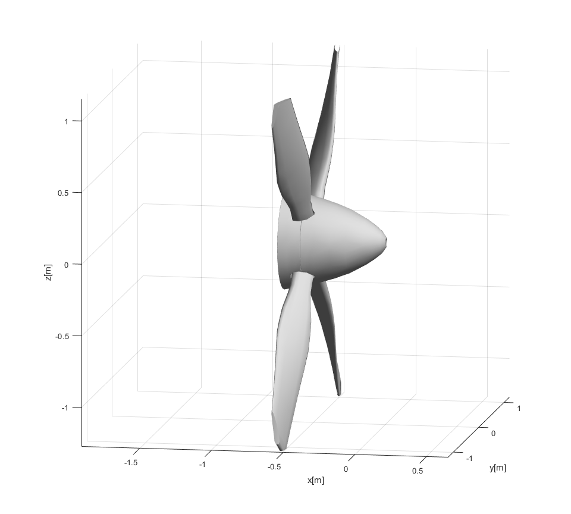

---
hide:
  - navigation
  # - toc
---
# Welcome to MkDocs

For full documentation visit [mkdocs.org](https://www.mkdocs.org).

:smile:
:fontawesome-regular-face-laugh-wink:

## Commands

* `mkdocs new [dir-name]` - Create a new project.
* `mkdocs serve` - Start the live-reloading docs server.
* `mkdocs build` - Build the documentation site.
* `mkdocs -h` - Print help message and exit.
	
## Project layout

    mkdocs.yml    # The configuration file.
    docs/
        index.md  # The documentation homepage.
        ...       # Other markdown pages, images and other files.


## Code annotation examples:

### Code blocks:

Some 'code' goes here $f = y(x)$

``` py
import tensorflow as tf
```

``` matlab title="A code snippet" hl_lines="2 3"
function [out] = myFunction(argA,argB)
	for iA = 1 : length(argB)
		% This is a comment
		out(iA) = argA * 2;
	end
end
```

A simple equation:
$$
a = b_c
$$

The homomorphism $f$ is injective if and only if its kernel is only the
singleton set $e_G$, because otherwise $\exists a,b\in G$ with $a\neq b$ such
that $f(a)=f(b)$.

{ align=left }